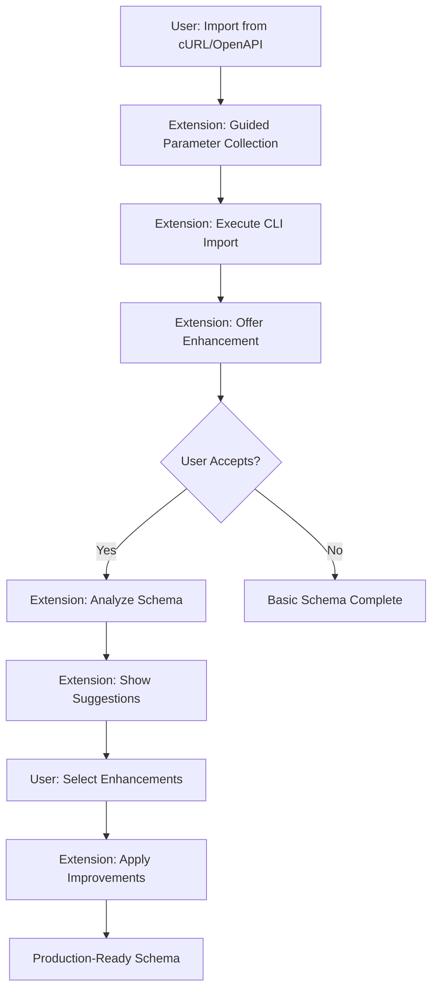
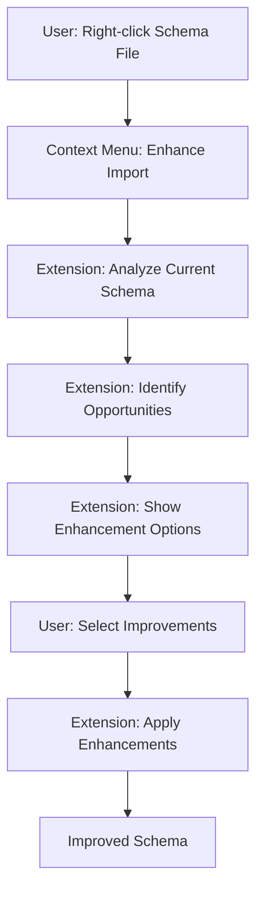

<!--
Copyright IBM Corp. 2025
Assisted by CursorAI
-->

# Import Enhancement System

The Import Enhancement System transforms basic CLI-generated schemas into production-ready GraphQL APIs through intelligent analysis and guided improvements.

## Overview

StepZen CLI provides excellent foundational import capabilities through `stepzen import curl` and `stepzen import openapi`. However, these commands generate basic schemas that often need refinement for production use. The VS Code extension enhances this workflow by adding intelligent analysis, guided improvements, and best practices enforcement.

## Architecture

### Two-Phase Approach

```
CLI Import (Foundation) → Extension Enhancement (Intelligence) → Production Ready
```

**Phase 1: CLI Import**

- Generates basic schema structure
- Creates fundamental `@rest` directives
- Establishes type definitions
- Provides working GraphQL endpoint

**Phase 2: Extension Enhancement**

- Analyzes generated schema
- Suggests specific improvements
- Applies advanced configurations
- Enforces best practices

## User Experience Flows

### Flow 1: New Import with Enhancement



### Flow 2: Enhance Existing Import



## Enhancement Categories

### 1. REST Directive Improvements

#### Response Transformation

- Improve `setters` for better field mapping
- Add `transforms` for data manipulation
- Optimize `resultroot` configuration
- Add `cel` for advanced content extraction
- Configure `ecmascript` for request/response modification

#### Authentication Enhancement

- Move sensitive values to configuration
- Add proper header management
- Configure secret handling
- Set up `forwardheaders` for authentication

#### Pagination Support

- Detect pagination patterns
- Add connection types
- Configure cursor-based pagination (`NEXT_CURSOR`, `OFFSET`, `PAGE_NUMBER`)

#### Caching Configuration

- Add appropriate cache policies (`ON`, `OFF`, `DEFAULT`, `FORCE`)
- Configure cache strategies
- Optimize performance

#### Request Configuration

- Configure HTTP methods (`GET`, `POST`, `PUT`, `DELETE`, `PATCH`)
- Set up `postbody` for mutations
- Configure `contenttype` for proper content handling
- Add `filter` for JSON row selection

### 2. Type System Enhancements

#### Field Naming

- Convert snake_case to camelCase
- Improve semantic naming
- Add proper GraphQL conventions

#### Documentation

- Add field descriptions
- Include type documentation
- Provide usage examples

#### Nullability Optimization

- Analyze required vs optional fields
- Optimize nullable types
- Improve type safety

#### Custom Scalars

- Add Date/DateTime scalars
- Include JSON scalar types
- Configure custom validation

### 3. Schema Organization

#### File Structure

- Split large schemas into modules
- Organize by domain/feature
- Create logical groupings

#### Relationship Mapping

- Add `@materializer` directives
- Create field connections
- Establish data relationships

#### Connection Patterns

- Add GraphQL connection types
- Implement pagination
- Configure filtering

#### Tool Integration

- Add `@tool` directives for LLM
- Configure AI-friendly schemas
- Enable intelligent querying

## Implementation Details

### New Commands

```typescript
// Command constants
IMPORT_CURL: "stepzen.importCurl";
IMPORT_OPENAPI: "stepzen.importOpenapi";
ENHANCE_IMPORT: "stepzen.enhanceImport";
ANALYZE_SCHEMA: "stepzen.analyzeSchema";
```

### Core Services

#### ImportDetectionService

```typescript
export class ImportDetectionService {
  /**
   * Monitors file system for CLI-generated schemas
   */
  async detectImportedSchemas(): Promise<ImportedSchema[]>;

  /**
   * Analyzes schema for enhancement opportunities
   */
  async analyzeSchema(schema: ImportedSchema): Promise<Enhancement[]>;

  /**
   * Identifies CLI-generated patterns
   */
  async identifyImportSource(file: string): Promise<ImportSource>;
}
```

#### SchemaEnhancementEngine

```typescript
export class SchemaEnhancementEngine {
  /**
   * Applies REST directive improvements
   */
  async enhanceRestDirective(
    directive: RestDirective,
    enhancements: RestEnhancement[]
  ): Promise<void>;

  /**
   * Improves type definitions
   */
  async enhanceTypes(
    types: GraphQLType[],
    enhancements: TypeEnhancement[]
  ): Promise<void>;

  /**
   * Organizes schema structure
   */
  async organizeSchema(
    schema: GraphQLSchema,
    organization: SchemaOrganization
  ): Promise<void>;
}
```

### Enhancement Configuration

#### RestEnhancement Interface

```typescript
interface RestEnhancement {
  // Response transformation
  improveSetters: boolean;
  addTransforms: boolean;
  optimizeResultRoot: boolean;
  addCelExtraction: boolean;
  configureEcmascript: boolean;

  // Authentication
  moveSecretsToConfig: boolean;
  improveHeaderManagement: boolean;
  addAuthPatterns: boolean;
  configureForwardHeaders: boolean;

  // Request configuration
  optimizeHttpMethod: boolean;
  configurePostBody: boolean;
  setContentType: boolean;
  addJsonFiltering: boolean;

  // Performance
  addCaching: boolean;
  configurePagination: boolean;
  optimizeQueries: boolean;
}
```

#### TypeEnhancement Interface

```typescript
interface TypeEnhancement {
  // Naming improvements
  convertFieldNames: boolean;
  improveSemanticNaming: boolean;
  addGraphQLConventions: boolean;

  // Documentation
  addFieldDescriptions: boolean;
  addTypeDocumentation: boolean;
  includeUsageExamples: boolean;

  // Type safety
  optimizeNullability: boolean;
  addCustomScalars: boolean;
  improveValidation: boolean;
}
```

#### SchemaOrganization Interface

```typescript
interface SchemaOrganization {
  // File structure
  splitIntoModules: boolean;
  organizeByDomain: boolean;
  createLogicalGroups: boolean;

  // Relationships
  addMaterializers: boolean;
  createConnections: boolean;
  establishRelationships: boolean;

  // Advanced features
  addToolDirectives: boolean;
  configureAIIntegration: boolean;
  enableIntelligentQuerying: boolean;
}
```

## Enhancement Examples

### Before: CLI-Generated Schema

```graphql
type User {
  id: String
  first_name: String
  last_name: String
  email_address: String
  created_at: String
  profile_data: JSON
}

extend type Query {
  getUser(id: String): User @rest(endpoint: "https://api.example.com/users/$id")

  listUsers: [User] @rest(endpoint: "https://api.example.com/users")
}
```

### After: Enhanced Schema

```graphql
"""
User account information with profile details
"""
type User {
  """
  Unique user identifier
  """
  id: ID!

  """
  User's first name
  """
  firstName: String!

  """
  User's last name
  """
  lastName: String!

  """
  Full display name
  """
  fullName: String
    @value(script: { language: ECMASCRIPT, src: "firstName + ' ' + lastName" })

  """
  Primary email address
  """
  email: String!

  """
  Account creation timestamp
  """
  createdAt: DateTime!

  """
  Detailed user profile
  """
  profile: UserProfile @materializer(query: "getUserProfile")

  """
  User's posts with pagination
  """
  posts(first: Int = 10, after: String): PostConnection
    @materializer(query: "getUserPosts")
}

"""
Detailed user profile information
"""
type UserProfile {
  """
  Profile avatar URL
  """
  avatar: String

  """
  User biography
  """
  bio: String

  """
  Geographic location
  """
  location: String

  """
  Social media links
  """
  socialLinks: [SocialLink!]
}

"""
Social media link information
"""
type SocialLink {
  """
  Platform name (twitter, linkedin, etc.)
  """
  platform: String!

  """
  Profile URL
  """
  url: String!
}

"""
Connection type for paginated posts
"""
type PostConnection {
  edges: [PostEdge!]!
  pageInfo: PageInfo!
}

type PostEdge {
  node: Post!
  cursor: String!
}

extend type Query {
  """
  Retrieve a user by their unique identifier
  """
  getUser(
    """
    User ID to retrieve
    """
    id: ID!
  ): User
    @rest(
      endpoint: "https://api.example.com/users/$id"
      headers: [
        { name: "Authorization", value: "$apiKey" }
        { name: "Accept", value: "application/json" }
      ]
      setters: [
        { field: "firstName", path: "first_name" }
        { field: "lastName", path: "last_name" }
        { field: "email", path: "email_address" }
        { field: "createdAt", path: "created_at" }
      ]
      cachepolicy: { strategy: ON }
    )

  """
  List all users with optional filtering
  """
  listUsers(
    """
    Maximum number of users to return
    """
    limit: Int = 20
    """
    Offset for pagination
    """
    offset: Int = 0
  ): [User!]!
    @rest(
      endpoint: "https://api.example.com/users?limit=$limit&offset=$offset"
      headers: [{ name: "Authorization", value: "$apiKey" }]
      setters: [
        { field: "firstName", path: "first_name" }
        { field: "lastName", path: "last_name" }
        { field: "email", path: "email_address" }
        { field: "createdAt", path: "created_at" }
      ]
      resultroot: "users"
      cachepolicy: { strategy: ON }
    )

  """
  Get detailed user profile
  """
  getUserProfile(
    """
    User ID
    """
    userId: ID!
  ): UserProfile
    @rest(
      endpoint: "https://api.example.com/users/$userId/profile"
      headers: [{ name: "Authorization", value: "$apiKey" }]
      setters: [{ field: "socialLinks", path: "social_media" }]
    )

  """
  Get user's posts with pagination
  """
  getUserPosts(
    """
    User ID
    """
    userId: ID!
    """
    Number of posts to return
    """
    first: Int = 10
    """
    Cursor for pagination
    """
    after: String = ""
  ): PostConnection
    @rest(
      endpoint: "https://api.example.com/users/$userId/posts?limit=$first&after=$after"
      headers: [{ name: "Authorization", value: "$apiKey" }]
      resultroot: "posts"
      pagination: {
        type: NEXT_CURSOR
        setters: [{ field: "nextCursor", path: "pagination.next_cursor" }]
      }
    )
}
```

### Configuration Enhancement

#### Before: Basic Configuration

```yaml
configurationset:
  - configuration:
      name: api_config
      endpoint: https://api.example.com
```

#### After: Enhanced Configuration

```yaml
configurationset:
  - configuration:
      name: api_config
      endpoint: https://api.example.com
      apiKey: $API_KEY
      timeout: 30s
      retries: 3
      cache.ttl: 300s
      batch.maxsize: 10
      batch.timeout: 50ms
```

## Integration Points

### Existing Extension Features

#### Schema Index Service

- Update index after enhancements
- Track schema changes
- Maintain field relationships

#### Directive Builder

- Reuse for enhancement application
- Extend with new directive types
- Maintain consistent formatting

#### Error Handling

- Consistent error patterns
- User-friendly messages
- Proper error recovery

#### Logging Service

- Track enhancement operations
- Debug enhancement issues
- Monitor performance

### CLI Integration

#### Command Execution

```typescript
// Execute CLI import with extension parameters
await services.cli.spawnProcessWithOutput([
  "import",
  "curl",
  endpoint,
  ...headers,
  ...authConfig,
  "--name",
  schemaName,
  "--dir",
  targetDirectory,
]);
```

#### Parameter Collection

```typescript
// Collect parameters through VS Code UI
const importConfig = await collectImportParameters();
const cliArgs = buildCliArguments(importConfig);
```

## Future Enhancements

### AI-Powered Improvements

#### Intelligent Naming

- Use LLM to suggest better field names
- Analyze API documentation for context
- Apply domain-specific conventions

#### Smart Documentation

- Generate descriptions from API specs
- Create usage examples
- Add best practice comments

#### Pattern Recognition

- Identify common API patterns
- Suggest standard implementations
- Apply proven solutions

### Template Library

#### Popular APIs

- Pre-built enhancement templates
- Common configuration patterns
- Best practice implementations

#### Domain-Specific

- E-commerce API patterns
- Social media integrations
- Payment processing schemas

#### Custom Templates

- Team-specific patterns
- Organization standards
- Reusable configurations

### Collaborative Features

#### Enhancement Sharing

- Share enhancement patterns
- Community-driven improvements
- Best practice libraries

#### Team Standards

- Enforce organization patterns
- Consistent naming conventions
- Standardized configurations

## Testing Strategy

### Unit Tests

- Enhancement detection logic
- Schema analysis algorithms
- Configuration generation

### Integration Tests

- CLI command execution
- File system operations
- Schema modification workflows

### End-to-End Tests

- Complete import workflows
- Enhancement application
- User interaction scenarios

## Performance Considerations

### Lazy Loading

- Load enhancement engine on demand
- Cache analysis results
- Minimize memory footprint

### Incremental Analysis

- Analyze only changed files
- Cache enhancement suggestions
- Optimize for large schemas

### Background Processing

- Run analysis in background
- Non-blocking user interface
- Progress indication

## Security Considerations

### Secret Management

- Move API keys to configuration
- Secure credential storage
- Environment variable integration

### Validation

- Validate enhancement inputs
- Sanitize user parameters
- Prevent injection attacks

### Access Control

- Respect workspace trust
- Validate file permissions
- Secure temporary files

---

_Portions of the Content may be generated with the assistance of CursorAI_
