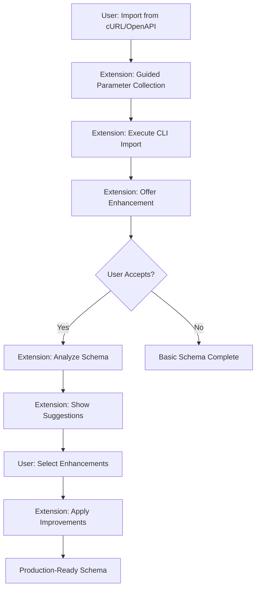
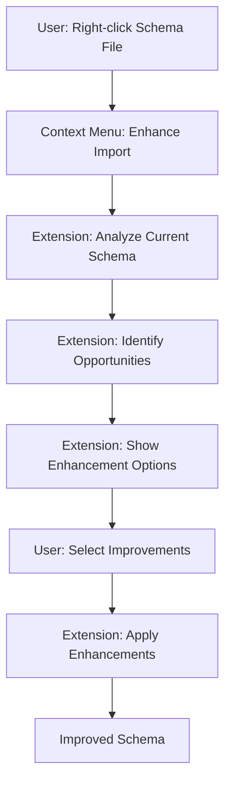

<!--
Copyright IBM Corp. 2025
Assisted by CursorAI
-->

# Import Enhancement System

The Import Enhancement System transforms basic CLI-generated schemas into production-ready GraphQL APIs through intelligent analysis and guided improvements.

## Overview

StepZen CLI provides excellent foundational import capabilities through `stepzen import curl` and `stepzen import openapi`. However, these commands generate basic schemas that often need refinement for production use. The VS Code extension enhances this workflow by adding intelligent analysis, guided improvements, and best practices enforcement.

## Architecture

### Two-Phase Approach

```
CLI Import (Foundation) → Extension Enhancement (Intelligence) → Production Ready
```

**Phase 1: CLI Import**

- Generates basic schema structure
- Creates fundamental `@rest` directives
- Establishes type definitions
- Provides working GraphQL endpoint

**Phase 2: Extension Enhancement**

- Analyzes generated schema
- Suggests specific improvements
- Applies advanced configurations
- Enforces best practices

## User Experience Flows

### Flow 1: New Import with Enhancement



### Flow 2: Enhance Existing Import



## Enhancement Categories

### 1. REST Directive Improvements

#### Response Transformation

- Optimize `resultroot` configuration for simple JSON path extraction
- Improve `setters` for small field mapping changes
- Add `transforms` with JSONata or jq for significant data manipulation
- Configure `ecmascript` only when JSONata/jq transforms are insufficient

#### Authentication Enhancement

- Move sensitive values to configuration
- Add proper header management
- Configure secret handling
- Set up `forwardheaders` for authentication

#### Pagination Support

- Detect pagination patterns
- Add connection types
- Configure cursor-based pagination (`NEXT_CURSOR`, `OFFSET`, `PAGE_NUMBER`)

#### Request Configuration

- Configure HTTP methods (`GET`, `POST`, `PUT`, `DELETE`, `PATCH`)
- Set up `postbody` for mutations
- Configure `contenttype` for proper content handling
- Optionally configure `cachepolicy` when default behavior needs adjustment

### 2. Type System Enhancements

#### Field Naming

- Convert snake_case to camelCase
- Improve semantic naming
- Add proper GraphQL conventions

#### Documentation

- Add field descriptions
- Include type documentation
- Provide usage examples

#### Nullability Optimization

- Analyze required vs optional fields
- Optimize nullable types
- Improve type safety

#### Built-in Scalar Usage

- Use appropriate built-in scalars (Date, DateTime, JSON, Secret)
- Convert string dates to Date/DateTime types
- Use JSON scalar for complex nested data
- Use Secret scalar for sensitive argument types

### 3. Schema Organization

_Note: These enhancements apply to all StepZen directives (@rest, @dbquery, @graphql, etc.)_

#### Relationship Mapping

- Add `@materializer` directives to connect related data
- Create field connections between types
- Establish data relationships across different data sources

#### Connection Patterns

- Add GraphQL connection types for pagination
- Implement cursor-based pagination (works with @rest and @dbquery)
- Configure filtering patterns (@dbquery has built-in filtering, @rest could use schema-based filtering)

#### Tool Integration

- Add `@tool` directives for LLM integration
- Configure AI-friendly schemas
- Enable intelligent querying across all data sources

#### File Structure (Future Enhancement)

_This could become a standalone "Organize Schema" command_

- Analyze entire schema structure
- Split large schemas into logical modules
- Organize by domain/feature across all directive types
- Create logical groupings for better maintainability

## Implementation Details

### Architecture Alignment

The Import Enhancement System follows the established [extension architecture](./architecture.md) with proper service registry integration and layered design.

### New Commands

```typescript
// src/utils/constants.ts - Command constants
export const COMMANDS = {
  // ... existing commands
  IMPORT_CURL: "stepzen.importCurl";
  IMPORT_OPENAPI: "stepzen.importOpenapi";
  ENHANCE_IMPORT: "stepzen.enhanceImport";
  ANALYZE_SCHEMA: "stepzen.analyzeSchema";
} as const;
```

### Service Registry Integration

Following the established dependency injection pattern, new services will be added to the service registry:

```typescript
// src/services/index.ts
export interface ServiceRegistry {
  // Existing services
  cli: StepzenCliService;
  logger: Logger;
  projectResolver: ProjectResolver;
  schemaIndex: SchemaIndexService;
  request: RequestService;

  // New import enhancement service
  schemaEnhancement: SchemaEnhancementEngine;
}

export const services: ServiceRegistry = {
  // ... existing services
  schemaEnhancement: new SchemaEnhancementEngine(logger),
};
```

### Core Services

#### Leveraging Existing SchemaIndexService

The existing `SchemaIndexService` already provides:

- File watching for GraphQL schema changes
- Automatic indexing of new schema files
- Type and directive analysis
- Field relationship tracking

For import enhancement, we'll extend this existing service rather than creating a new detection service:

```typescript
// Enhancement detection leverages existing schema indexing
const enhancementOpportunities = await analyzeSchemaForEnhancements(
  services.schemaIndex.getFieldIndex(),
  services.schemaIndex.getTypeDefinitions()
);
```

#### SchemaEnhancementEngine

```typescript
// src/services/schemaEnhancement.ts
export class SchemaEnhancementEngine {
  constructor(private logger: Logger) {}

  /**
   * Analyzes schema for enhancement opportunities
   * Uses existing SchemaIndexService data instead of parsing files directly
   */
  async analyzeSchema(
    filePath: string,
    fieldIndex: FieldIndex,
    typeDefinitions: TypeDefinitions
  ): Promise<Enhancement[]> {
    this.logger.info(`Analyzing schema for enhancements: ${filePath}`);
    try {
      const opportunities: Enhancement[] = [];

      // Analyze REST directives using existing field index
      const restFields = fieldIndex.getFieldsByDirective("@rest");
      for (const field of restFields) {
        const restEnhancements = this.analyzeRestDirective(field);
        opportunities.push(...restEnhancements);
      }

      // Analyze type definitions using existing type index
      const types = typeDefinitions.getTypesInFile(filePath);
      for (const type of types) {
        const typeEnhancements = this.analyzeTypeDefinition(type);
        opportunities.push(...typeEnhancements);
      }

      // Analyze schema organization opportunities
      const organizationEnhancements = this.analyzeSchemaOrganization(
        fieldIndex,
        typeDefinitions
      );
      opportunities.push(...organizationEnhancements);

      return opportunities;
    } catch (err) {
      this.logger.error("Schema analysis failed", err);
      throw new ValidationError(
        "Schema analysis failed",
        "ANALYSIS_FAILED",
        err
      );
    }
  }

  /**
   * Applies REST directive improvements
   * Uses existing DirectiveBuilder for consistent formatting
   */
  async enhanceRestDirective(
    directive: RestDirective,
    enhancements: RestEnhancement[]
  ): Promise<void> {
    this.logger.info("Enhancing @rest directive");
    try {
      // Use DirectiveBuilder.createRestConfig() pattern
      // Apply enhancements using established patterns
    } catch (err) {
      this.logger.error("REST directive enhancement failed", err);
      throw new ValidationError(
        "Enhancement failed",
        "ENHANCEMENT_FAILED",
        err
      );
    }
  }

  /**
   * Improves type definitions
   * Integrates with SchemaIndexService for type analysis
   */
  async enhanceTypes(
    types: GraphQLType[],
    enhancements: TypeEnhancement[]
  ): Promise<void> {
    this.logger.info(`Enhancing ${types.length} type definitions`);
    try {
      // Use services.schemaIndex for type information
      // Apply built-in scalar conversions
    } catch (err) {
      this.logger.error("Type enhancement failed", err);
      throw new ValidationError(
        "Type enhancement failed",
        "TYPE_ENHANCEMENT_FAILED",
        err
      );
    }
  }

  /**
   * Organizes schema structure
   * Works across all directive types (@rest, @dbquery, @graphql)
   */
  async organizeSchema(
    schema: GraphQLSchema,
    organization: SchemaOrganization
  ): Promise<void> {
    this.logger.info("Organizing schema structure");
    try {
      // Cross-directive analysis and organization
      // Use existing schema processing patterns
    } catch (err) {
      this.logger.error("Schema organization failed", err);
      throw new ValidationError(
        "Schema organization failed",
        "ORGANIZATION_FAILED",
        err
      );
    }
  }

  /**
   * Identifies CLI-generated patterns in schema
   * Uses existing schema index data to detect import patterns
   */
  private identifyImportPatterns(
    fieldIndex: FieldIndex,
    typeDefinitions: TypeDefinitions
  ): ImportPattern[] {
    this.logger.debug("Identifying CLI import patterns");

    // Look for patterns typical of CLI-generated schemas:
    // - Basic @rest directives without advanced features
    // - Snake_case field names
    // - Missing documentation
    // - Suboptimal type usage (String instead of Date/DateTime)

    return [];
  }
}
```

### Command Implementation Pattern

Following the established command pattern from architecture.md:

```typescript
// src/commands/importCurl.ts
export async function importCurl() {
  try {
    services.logger.info("Starting cURL import with enhancement");

    // 1. Check workspace trust
    if (!vscode.workspace.isTrusted) {
      vscode.window.showWarningMessage(
        "Import features not available in untrusted workspaces"
      );
      return;
    }

    // 2. Collect parameters through VS Code UI
    const importConfig = await collectCurlParameters();
    if (!importConfig) {
      services.logger.info("cURL import cancelled by user");
      return;
    }

    // 3. Execute CLI import using existing CLI service
    const cliArgs = buildCurlImportArgs(importConfig);
    await services.cli.spawnProcessWithOutput(["import", "curl", ...cliArgs]);

    // 4. Wait for schema indexing to complete (existing file watcher will trigger)
    // The SchemaIndexService will automatically detect and index the new schema file

    // 5. Offer enhancement using existing schema index
    await offerEnhancement(importConfig.targetFile);

    services.logger.info("cURL import with enhancement completed");
  } catch (err) {
    handleError(err); // Use established error handling
  }
}

// Enhancement command leverages existing schema indexing
export async function enhanceImport() {
  try {
    services.logger.info("Starting schema enhancement");

    // 1. Get current file from active editor
    const editor = vscode.window.activeTextEditor;
    if (!editor || !editor.document.fileName.endsWith(".graphql")) {
      vscode.window.showErrorMessage("Please open a GraphQL schema file");
      return;
    }

    // 2. Use existing schema index to analyze the file
    const fieldIndex = services.schemaIndex.getFieldIndex();
    const typeDefinitions = services.schemaIndex.getTypeDefinitions();

    // 3. Analyze for enhancement opportunities
    const opportunities = await services.schemaEnhancement.analyzeSchema(
      editor.document.fileName,
      fieldIndex,
      typeDefinitions
    );

    // 4. Present enhancement options to user
    if (opportunities.length === 0) {
      vscode.window.showInformationMessage(
        "No enhancement opportunities found"
      );
      return;
    }

    const selectedEnhancements = await presentEnhancementOptions(opportunities);
    if (!selectedEnhancements) {
      services.logger.info("Enhancement cancelled by user");
      return;
    }

    // 5. Apply enhancements
    await services.schemaEnhancement.applyEnhancements(
      editor.document.fileName,
      selectedEnhancements
    );

    services.logger.info("Schema enhancement completed");
  } catch (err) {
    handleError(err);
  }
}
```

### Error Handling Integration

Following the established error hierarchy:

```typescript
// src/errors/index.ts - Extend existing error types
export class ImportError extends StepZenError {
  constructor(message: string, code: string, cause?: unknown) {
    super(message, code, cause);
    this.name = "ImportError";
  }
}

export class EnhancementError extends StepZenError {
  constructor(message: string, code: string, cause?: unknown) {
    super(message, code, cause);
    this.name = "EnhancementError";
  }
}
```

### CLI Integration

Leveraging the existing CLI service patterns:

```typescript
// Execute CLI import with extension parameters
await services.cli.spawnProcessWithOutput([
  "import",
  "curl",
  endpoint,
  ...headers,
  ...authConfig,
  "--name",
  schemaName,
  "--dir",
  targetDirectory,
]);
```

### Schema Processing Integration

Using existing schema processing layer:

```typescript
// Leverage existing SchemaIndexService
const fieldIndex = services.schemaIndex.getFieldIndex();
const typeDefinitions = services.schemaIndex.getTypeDefinitions();

// Use existing DirectiveBuilder for consistent formatting
const enhancedDirective = DirectiveBuilder.createRestConfig({
  endpoint: improvedEndpoint,
  headers: enhancedHeaders,
  setters: optimizedSetters,
});
```

### Testing Strategy Alignment

Following established testing patterns:

```typescript
// src/test/unit/services/importDetection.test.ts
suite("ImportDetectionService", () => {
  let service: ImportDetectionService;
  let mockLogger: Logger;

  setup(() => {
    mockLogger = createMock<Logger>();
    service = new ImportDetectionService(mockLogger);
  });

  test("should detect CLI-generated schemas", async () => {
    // Test implementation following established patterns
  });
});
```

### WebView Integration (Future)

When adding enhancement UI, follow established WebView patterns:

```typescript
// Future: Enhancement selection UI
// src/panels/enhancementPanel.ts
export class EnhancementPanel {
  // Follow existing panel patterns from resultsPanel.ts
  // Use established WebView communication patterns
}
```

### Enhancement Configuration Types

Following TypeScript strict typing patterns established in the architecture:

#### RestEnhancement Interface

```typescript
// src/types/enhancement.ts
export interface RestEnhancement {
  // Response transformation (in order of preference)
  optimizeResultRoot: boolean; // Simple JSON path extraction
  improveSetters: boolean; // Small field mapping changes
  addJsonataTransforms: boolean; // Preferred for significant data manipulation
  addJqTransforms: boolean; // Alternative to JSONata for complex transforms
  configureEcmascript: boolean; // Last resort when JSONata/jq insufficient

  // Authentication
  moveSecretsToConfig: boolean;
  improveHeaderManagement: boolean;
  addAuthPatterns: boolean;
  configureForwardHeaders: boolean;

  // Request configuration
  optimizeHttpMethod: boolean;
  configurePostBody: boolean;
  setContentType: boolean;

  // Pagination and performance
  configurePagination: boolean;
  optimizeQueries: boolean;

  // Advanced options (rarely needed)
  adjustCachePolicy: boolean; // Only when default caching needs modification
}
```

#### TypeEnhancement Interface

```typescript
export interface TypeEnhancement {
  // Naming improvements
  convertFieldNames: boolean;
  improveSemanticNaming: boolean;
  addGraphQLConventions: boolean;

  // Documentation
  addFieldDescriptions: boolean;
  addTypeDocumentation: boolean;
  includeUsageExamples: boolean;

  // Type safety
  optimizeNullability: boolean;
  useBuiltinScalars: boolean;
  improveTypeDefinitions: boolean;
}
```

#### SchemaOrganization Interface

```typescript
export interface SchemaOrganization {
  // Cross-directive relationship mapping
  addMaterializers: boolean;
  createConnections: boolean;
  establishRelationships: boolean;

  // Pagination and filtering (works with @rest, @dbquery, etc.)
  addConnectionTypes: boolean;
  configurePagination: boolean;
  addFilteringPatterns: boolean;

  // AI and tooling integration
  addToolDirectives: boolean;
  configureAIIntegration: boolean;
  enableIntelligentQuerying: boolean;

  // Future: File structure organization (potential standalone command)
  // splitIntoModules: boolean;
  // organizeByDomain: boolean;
  // createLogicalGroups: boolean;
}
```

## Enhancement Examples

### Before: CLI-Generated Schema

```graphql
type User {
  id: String
  first_name: String
  last_name: String
  email_address: String
  created_at: String
  profile_data: JSON
}

extend type Query {
  getUser(id: String): User @rest(endpoint: "https://api.example.com/users/$id")

  listUsers: [User] @rest(endpoint: "https://api.example.com/users")
}
```

### After: Enhanced Schema

```graphql
"""
User account information with profile details
"""
type User {
  """
  Unique user identifier
  """
  id: ID!

  """
  User's first name
  """
  firstName: String!

  """
  User's last name
  """
  lastName: String!

  """
  Full display name
  """
  fullName: String
    @value(script: { language: ECMASCRIPT, src: "firstName + ' ' + lastName" })

  """
  Primary email address
  """
  email: String!

  """
  Account creation timestamp
  """
  createdAt: DateTime!

  """
  Detailed user profile
  """
  profile: UserProfile @materializer(query: "getUserProfile")

  """
  User's posts with pagination
  """
  posts(first: Int = 10, after: String): PostConnection
    @materializer(query: "getUserPosts")
}

"""
Detailed user profile information
"""
type UserProfile {
  """
  Profile avatar URL
  """
  avatar: String

  """
  User biography
  """
  bio: String

  """
  Geographic location
  """
  location: String

  """
  Social media links
  """
  socialLinks: [SocialLink!]
}

"""
Social media link information
"""
type SocialLink {
  """
  Platform name (twitter, linkedin, etc.)
  """
  platform: String!

  """
  Profile URL
  """
  url: String!
}

"""
Connection type for paginated users
"""
type UserConnection {
  edges: [UserEdge!]!
  pageInfo: PageInfo!
}

type UserEdge {
  node: User!
  cursor: String!
}

"""
Connection type for paginated posts
"""
type PostConnection {
  edges: [PostEdge!]!
  pageInfo: PageInfo!
}

type PostEdge {
  node: Post!
  cursor: String!
}

extend type Query {
  """
  Retrieve a user by their unique identifier
  """
  getUser(
    """
    User ID to retrieve
    """
    id: ID!
  ): User
    @rest(
      endpoint: "https://api.example.com/users/$id"
      headers: [
        { name: "Authorization", value: "$apiKey" }
        { name: "Accept", value: "application/json" }
      ]
      setters: [
        { field: "firstName", path: "first_name" }
        { field: "lastName", path: "last_name" }
        { field: "email", path: "email_address" }
        { field: "createdAt", path: "created_at" }
      ]
      cachepolicy: { strategy: ON }
    )

  """
  List all users with GraphQL Cursor Connections pagination
  """
  listUsers(
    """
    Maximum number of users to return
    """
    first: Int = 20
    """
    Cursor for pagination
    """
    after: String = ""
  ): UserConnection
    @rest(
      endpoint: "https://api.example.com/users?limit=$first&after=$after"
      headers: [{ name: "Authorization", value: "$apiKey" }]
      setters: [
        { field: "firstName", path: "first_name" }
        { field: "lastName", path: "last_name" }
        { field: "email", path: "email_address" }
        { field: "createdAt", path: "created_at" }
      ]
      resultroot: "users"
      pagination: {
        type: NEXT_CURSOR
        setters: [{ field: "nextCursor", path: "pagination.next_cursor" }]
      }
      cachepolicy: { strategy: ON }
    )

  """
  Get detailed user profile
  """
  getUserProfile(
    """
    User ID
    """
    userId: ID!
  ): UserProfile
    @rest(
      endpoint: "https://api.example.com/users/$userId/profile"
      headers: [{ name: "Authorization", value: "$apiKey" }]
      setters: [{ field: "socialLinks", path: "social_media" }]
    )

  """
  Get user's posts with pagination
  """
  getUserPosts(
    """
    User ID
    """
    userId: ID!
    """
    Number of posts to return
    """
    first: Int = 10
    """
    Cursor for pagination
    """
    after: String = ""
  ): PostConnection
    @rest(
      endpoint: "https://api.example.com/users/$userId/posts?limit=$first&after=$after"
      headers: [{ name: "Authorization", value: "$apiKey" }]
      resultroot: "posts"
      pagination: {
        type: NEXT_CURSOR
        setters: [{ field: "nextCursor", path: "pagination.next_cursor" }]
      }
    )
}
```

### Configuration Enhancement

#### Before: Basic Configuration

```yaml
configurationset:
  - configuration:
      name: api_config
      endpoint: https://api.example.com
```

#### After: Enhanced Configuration

```yaml
# TODO: Research actual supported configuration values
# Need to understand:
# - What configuration keys are actually supported?
# - Which values affect StepZen behavior vs. just variable substitution?
# - What do timeout, retry, caching, batching settings actually do?
# - Which settings apply to @rest vs @graphql vs @dbquery?

configurationset:
  - configuration:
      name: api_config
      endpoint: https://api.example.com
      apiKey: $API_KEY
      # Additional configuration values TBD based on research
```

## Integration Points

### Existing Extension Features

#### Schema Index Service

- Update index after enhancements
- Track schema changes
- Maintain field relationships

#### Directive Builder

- Reuse for enhancement application
- Extend with new directive types
- Maintain consistent formatting

#### Error Handling

- Consistent error patterns
- User-friendly messages
- Proper error recovery

#### Logging Service

- Track enhancement operations
- Debug enhancement issues
- Monitor performance

### CLI Integration

#### Command Execution

```typescript
// Execute CLI import with extension parameters
await services.cli.spawnProcessWithOutput([
  "import",
  "curl",
  endpoint,
  ...headers,
  ...authConfig,
  "--name",
  schemaName,
  "--dir",
  targetDirectory,
]);
```

#### Parameter Collection

```typescript
// Collect parameters through VS Code UI
const importConfig = await collectImportParameters();
const cliArgs = buildCliArguments(importConfig);
```

## Future Enhancements

### AI-Powered Improvements

#### Intelligent Naming

- Use LLM to suggest better field names
- Analyze API documentation for context
- Apply domain-specific conventions

#### Smart Documentation

- Generate descriptions from API specs
- Create usage examples
- Add best practice comments

#### Pattern Recognition

- Identify common API patterns
- Suggest standard implementations
- Apply proven solutions

### Template Library

#### Popular APIs

- Pre-built enhancement templates
- Common configuration patterns
- Best practice implementations

#### Domain-Specific

- E-commerce API patterns
- Social media integrations
- Payment processing schemas

#### Custom Templates

- Team-specific patterns
- Organization standards
- Reusable configurations

### Collaborative Features

#### Enhancement Sharing

- Share enhancement patterns
- Community-driven improvements
- Best practice libraries

#### Team Standards

- Enforce organization patterns
- Consistent naming conventions
- Standardized configurations

## Testing Strategy

### Unit Tests

- Enhancement detection logic
- Schema analysis algorithms
- Configuration generation

### Integration Tests

- CLI command execution
- File system operations
- Schema modification workflows

### End-to-End Tests

- Complete import workflows
- Enhancement application
- User interaction scenarios

## Performance Considerations

### Lazy Loading

- Load enhancement engine on demand
- Cache analysis results
- Minimize memory footprint

### Incremental Analysis

- Analyze only changed files
- Cache enhancement suggestions
- Optimize for large schemas

### Background Processing

- Run analysis in background
- Non-blocking user interface
- Progress indication

## Security Considerations

### Secret Management

- Move API keys to configuration
- Secure credential storage
- Environment variable integration

### Validation

- Validate enhancement inputs
- Sanitize user parameters
- Prevent injection attacks

### Access Control

- Respect workspace trust
- Validate file permissions
- Secure temporary files

### Response Transformation Decision Tree

The extension should guide users to the most appropriate transformation approach based on their needs:

#### 1. Simple JSON Path Extraction → `resultroot`

**Use when:** The API response has the data nested in a predictable location

```graphql
# API returns: {"data": {"users": [...]}}
# Use: resultroot: "data.users"
```

#### 2. Small Field Mapping → `setters`

**Use when:** Only a few fields need renaming or simple path changes

```graphql
# API returns: {"first_name": "John", "email_addr": "john@example.com"}
# Use: setters: [
#   {field: "firstName", path: "first_name"}
#   {field: "email", path: "email_addr"}
# ]
```

#### 3. Significant Data Manipulation → `transforms` with JSONata/jq

**Use when:** Complex data restructuring, filtering, or computation is needed

**JSONata (Preferred):**

```graphql
# Complex object transformation, filtering, aggregation
transforms: [{
  pathpattern: ["data"]
  editor: "jsonata:$map(users, function($user) {
    'fullName': $user.firstName & ' ' & $user.lastName,
    'email': $user.email,
    'isActive': $user.status = 'active'
  })"
}]
```

**jq (Alternative):**

```graphql
# For users familiar with jq syntax
transforms: [{
  pathpattern: ["data"]
  editor: "jq:.users | map({fullName: (.firstName + \" \" + .lastName), email, isActive: (.status == \"active\")})"
}]
```

#### 4. Advanced Cases → `ecmascript`

**Use `ecmascript` only when:** JSONata and jq cannot accomplish the required transformation

### Enhancement Strategy

The extension should:

1. **Analyze the transformation complexity** needed
2. **Recommend the simplest approach** that meets the requirements
3. **Provide examples** for the recommended approach
4. **Avoid complex solutions** unless absolutely necessary
5. **Suggest JSONata over jq** for new implementations (better performance/safety)

---

_Portions of the Content may be generated with the assistance of CursorAI_
